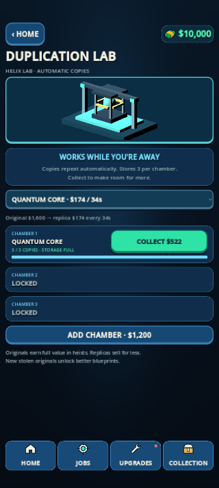

# Duplication Idle V2 — 0.9.50

The recovered Laboratory now repeats copies automatically, online and offline. Scans and one-shot production are removed. Successful escapes still pay the full original loot value immediately; every genuinely escaped type becomes a reusable blueprint, including items secured before Laboratory unlock. A successful, nonempty Laboratory escape unlocks the machine. Access remains on Laboratory's Jobs card (`IDLE LAB`), with the machine physically represented in Laboratory.

## Production and payout

One free chamber; chamber two costs $1,200 and chamber three $2,400. Each chamber holds three finished replicas, then pauses. Collect sells the stored replicas, credits the wallet once, and allows production to continue with the same blueprint. No scan, additional heist, restart button, or maintenance fee is required. Partial-cycle progress survives collection. A full chamber has no invisible backlog; time spent full is discarded. Changing a blueprint restarts its cycle and is allowed only after collecting existing rewards.

Replica prices are deliberately lower than original loot prices and are shown before starting. Originals are not consumed and replicas do not grant campaign objectives, trophies, blueprints, or further duplication chambers.

For original cash value V, cycle T and source benchmark B:

```
T = clamp(18 + ceil(V / 100), 20, 45) seconds
B = source location's complete loot value / normal run duration
replica cash = max(1, min(floor(V × 0.20), floor(B × 0.06 × T)))
```

The source is the first campaign location containing the type. Unplaced legacy types fall back to Laboratory. Advancing the campaign does not increase existing blueprint prices. Every current item was exhaustively checked against the rate bound, including the minimum-$1 rule.

Each chamber produces at most 6% of its source's full-haul/time benchmark. Three chambers produce at most 18% of the highest source benchmark among their selected blueprints. This is a theoretical economy reference, **not a guarantee that passive income is 18% of every player's actual earnings**. Partial hauls, failures, menu time and player skill change real income. Player sessions are still needed to validate that subjective balance.

## Concrete calculations

| Blueprint | Original | Cycle | Replica | 1 chamber/min | All 3 chambers/min | Full 3-chamber storage |
|---|---:|---:|---:|---:|---:|---:|
| Microscope | $200 | 20 s | $40 | $120.00 | $360.00 | $360 |
| Quantum Core | $1,600 | 34 s | $174 | $307.06 | $921.18 | $1,566 |
| Time Machine | $2,000 | 38 s | $276 | $435.79 | $1,307.37 | $2,484 |
| Dracula Coffin | $2,000 | 38 s | $400 | $631.58 | $1,894.74 | $3,600 |

Rates assume continuous collection and exclude chamber purchase costs. Real payouts occur in whole cycles. Different $2,000 originals can have different replica prices because their source economies differ.

Laboratory contains $7,250 and allows 85 s: B = $85.2941/s. Quantum Core reaches exactly the 6% per-chamber bound ($174/34s). A chamber stores $522 after 102 s; three store $1,566, or 21.6% of one Laboratory full haul. Ten minutes or 24 hours away yield that same $1,566, not thousands of completed cycles. With continuously collected Quantum Core, the second chamber's incremental payback is 3.91 minutes and the third's 7.82 minutes. Offline storage limits make actual payback longer when not collecting.

First copies take 20–45 seconds, shorter than a normal run's full timer. That avoids 40-minute waits for a first useful reward. It does not promise the player cannot finish a very short run before a copy. The deliberately short storage window makes this an assist between heists rather than an overnight economy replacement.

## Persistence and migration

Schema 9 preserves previous campaign progression. Schema-8 saves are backed up before migration. Unused old scans receive $50 each, at most 12 scans/$600, once. Existing one-shot copies retain their promised full original payout and completion timestamp; new automatic cycles begin no earlier than that timestamp or migration time, whichever is later. Old Pawn Shop compensation runs only for pre-schema-8 saves, preventing a second refund during this migration.

Stored copies, partial progress, blueprint selection and time checkpoints persist. Elapsed production is computed in constant time when the machine is opened/queried; no background process or per-copy offline loop is needed. Backward clock changes cannot repeat an already paid period. This local prototype trusts the device clock; it does not claim server-authoritative protection against deliberate clock editing.

DEV startup still resets progress as previously requested. Use the Persistent build to test production across closing/relaunching the app. Suspend/resume and leaving the Laboratory screen during the same DEV session also accrue elapsed production.

## Verification

- `test_duplication_idle.gd`: 38 checks covering automatic repeats, exact cycle boundaries, partial progress, full-storage pause, 24-hour absence for every item, 30-minute repeated collection, chamber purchases, rollback, real file save/reload, one-time schema migration and old Pawn Shop compensation.
- `test_duplication_idle_ui.gd`: 24 checks using actual menu buttons, access gates, prices, collection, repeat-claim protection, upgrades and narrow safe-area widths. Eight rendered captures at 450×800 and 320×712 with simulated safe areas; full/running/empty/three-chamber states inspected.
- Exhaustive per-item values, rates, storage caps and incremental chamber payback: [duplication_idle_economy.csv](tests/duplication_idle_economy.csv).
- Regression results and export verification are recorded in the task's `tests/idle_*.log` files.
- Passing regressions: core 87, DEV 24, Variety 200, Laboratory V1 16, Laboratory local-tier route/settlement 6. Including the 62 dedicated idle/UI checks, 395 checks passed. The physical full Laboratory run still unlocks the machine, registers nine blueprints and banks the original $7,250 in addition to legitimate objective bonuses.
- All four Windows/Android DEV/Persistent builds exported successfully. Both packaged Windows startup smoke checks exit 0. Both Android manifests report 0.9.50, versionCode 67, arm64-v8a, and APK signing verification succeeds. Source `development/enabled=true` was restored. Android was exported and inspected, not played on a physical phone during this task. Godot still logs the environment's pre-existing root-certificate-store warning.
- The historical all-campaign `test_challenge_v2` run is **not a passing validation**: it has an existing misplaced indentation in the old migration fixture (`laboratory` lookup on the unlocked-locations array), old Apartment noise/drop and $210 payout assumptions after the map changed, and exceeded the 120-second campaign run limit. Its gameplay/formula code was not changed for this task. Current core, dedicated migration/idle and Laboratory route checks are used separately; do not report the historical campaign suite as passed.


